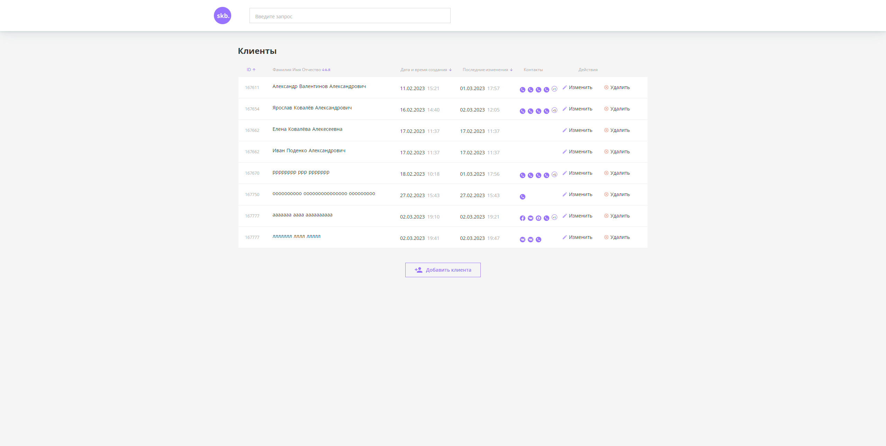
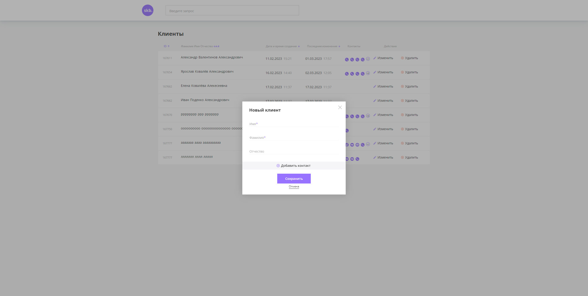

# Разработать web-интерфейс для CRM системы по учёту клиентов. Итоговый проект по курсу Javascript «Базовый уровень» Skillbox.

**Перед запуском убедитесь, что вы установили Node.js версии 12 или выше.**

**Для запуска сервера перейдите в папку *crm-backend* и выполните команду:**
```JavaScript
cd crm-backend - переход в папку с сервером

node index - запуск сервера
```
**Для остановки нажмите сочетание клавиш CTRL+C.**

*После запуска сервера API будет доступен по пути `http://localhost:3000`.*

---

### Скриншоты некоторых страниц:



---

### Техническое задание
**Разработать web-интерфейс-интерфейс для CRM системы, в которой должны быть следующие
ВОЗМОЖНОСТИ:**
- Просмотр списка людей в виде таблицы
- Добавление нового клиента
- Изменение информации о существующем клиенте
- Каждый контакт представляет из себя следующий набор данных:
  - Имя
  - Фамилия
  - Отчество
- Массив объектов с контактными данными, где каждый объект содержит:
  - Тип контакта (телефон, email, VK и т.п.)
  - Значение контакта (номер телефона, адрес email, ссылка на страницу в VK ит.п.)
  - Интерфейс представляет из себя единственную страницу, на которой располагается
таблица клиентов, кнопка для добавления нового клиента, а также шапка с логотипом
компании и строкой поиска клиентов. 


